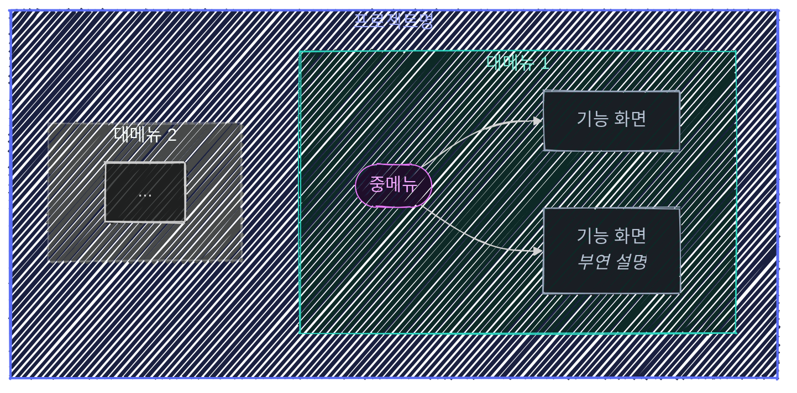

# 사이트맵 생성 스킬

## 레퍼런스

`references/sitemap-example.mmd`는 HR 플랫폼 도메인의 사이트맵 완성 예제다. 사이트맵 생성 시 이 파일을 읽고 구조·문법·스타일링을 그대로 따른다.

---

## 1. 사이트맵이란

화면(페이지) 단위로 서비스의 전체 구조를 계층적으로 표현한 다이어그램이다. 개발 전에 "어떤 화면이 있고, 어떻게 묶이는지"를 한눈에 보여준다.

## 2. 입력 처리 절차

### 2-1. 입력 수용

사용자가 제공할 수 있는 입력 형태:
- 자연어 프롬프트 ("쇼핑몰 사이트맵 만들어줘")
- 파일 (`.md`, `.pdf`, `.txt` 등 — PRD, 기획서, 요구사항)
- 기존 사이트맵 파일 (`.mmd` — 수정/확장 요청)

### 2-2. 구조 도출

1. **도메인 식별** — 주요 업무 영역을 식별한다 (예: 조직관리, 급여, 채용)
2. **화면 계층 설계** — 3단계 계층으로 구성한다
   - **L1 (대메뉴)**: 도메인 단위 — subgraph로 표현
   - **L2 (중메뉴)**: 기능 그룹 — `([stadium])` 노드
   - **L3 (기능 화면)**: 개별 화면 — `[rect]` 노드, 필요 시 부연 설명
3. **부연 설명 추가** — 핵심 기능에 마크다운 이탤릭으로 짧은 설명을 넣는다

---

## 3. Mermaid 출력 규칙

### 3-1. 파일 구조



### 3-2. 계층 표현 규칙

| 계층 | 표현 방식 | 노드 모양 |
|------|----------|----------|
| **루트** | 최상위 subgraph | `subgraph root["프로젝트명"]` |
| **L1 (대메뉴)** | 중첩 subgraph | `subgraph id["도메인명"]` |
| **L2 (중메뉴)** | stadium 노드 | `id([이름])` |
| **L3 (기능)** | rect 노드 | `id[이름]` 또는 `` id["`이름 *설명*`"] `` |

L2 → L3 연결만 화살표로 표현한다. 루트 → L1, L1 → L2는 subgraph 중첩으로 암시한다 (불필요한 선 제거).

### 3-3. 부연 설명 문법

마크다운 문자열로 노드 안에 이탤릭 부연을 넣는다:

```
node_id["`화면명
*짧은 설명*`"]
```

모든 노드에 넣을 필요 없다. 이름만으로 역할이 명확한 노드는 설명을 생략한다.

### 3-4. 다크 테마 색상 팔레트

depth별로 색상을 구분한다:

```
%% L2 (중메뉴) — 보라 계열
classDef l2 fill:#1f0e2a,stroke:#e879f9,color:#f0a8fc,stroke-width:1px

%% L3 (기능 화면) — 슬레이트 계열
classDef l3 fill:#1a1e24,stroke:#94a3b8,color:#b8c4d4,stroke-width:1px
```

L1 대메뉴 subgraph는 각각 다른 색상으로 `style` 지시어를 사용한다. 색상 팔레트:

```
청록:    fill:#0d2926,stroke:#2dd4bf,color:#7eecd8
초록:    fill:#0f2518,stroke:#4ade80,color:#8aedb3
라임:    fill:#1a2408,stroke:#a3e635,color:#c4ee7a
슬레이트: fill:#1a1e24,stroke:#94a3b8,color:#b8c4d4
앰버:    fill:#2a2208,stroke:#fbbf24,color:#fcd76a
인디고:  fill:#181a30,stroke:#818cf8,color:#b0b8fb
스카이:  fill:#0e1e2a,stroke:#38bdf8,color:#7ed4fb
보라:    fill:#1f0e2a,stroke:#e879f9,color:#f0a8fc
레드:    fill:#2a1414,stroke:#f87171,color:#fba4a4
오렌지:  fill:#2a1a0d,stroke:#fb923c,color:#fdb97a
```

---

## 4. 생성 → 리뷰 → 개선 워크플로우

### 4-1. 초안 생성

1. 입력을 분석하여 화면 계층을 도출한다
2. 레퍼런스를 읽고 구조를 맞춘다
3. `.mmd` 파일을 생성한다
   - CWD에 `.wiki` 심볼릭 링크가 있어야 한다. 없으면 "`agent-wiki` 스킬로 위키 환경을 먼저 구성해주세요"라고 안내하고 중단한다
   - 사용자가 경로를 지정하면 그곳에 생성한다
   - 지정하지 않으면 `.wiki/design/`에 생성한다 (폴더가 없으면 생성)
4. 사용자에게 VS Code에서 프리뷰를 확인하도록 안내한다

### 4-2. 리뷰 반영

사용자 피드백에 따라 수정한다:
- 도메인(대메뉴) 추가/삭제/이름 변경
- 기능 그룹(중메뉴) 재구성
- 기능 화면 추가/삭제
- 부연 설명 추가/수정
- 색상 변경

### 4-3. 검증 기준

- **3-클릭 규칙**: 루트에서 모든 기능 화면까지 3단계 이내
- **중복 없음**: 같은 기능이 여러 곳에 중복 배치되지 않는가
- **일관된 라벨링**: 같은 패턴의 화면은 같은 네이밍 규칙 (목록, 상세, 등록/수정 등)
- **빠진 화면 없음**: PRD의 모든 기능 요구사항이 화면으로 매핑되는가

---

## 5. 출력 스펙

- 단일 `.mmd` 파일
- VS Code Mermaid 프리뷰 확장에서 바로 렌더링 가능
- 파일명: `{프로젝트명}-sitemap.mmd` (예: `hr-platform-sitemap.mmd`)
- 한 파일에 하나의 `flowchart`만 포함
